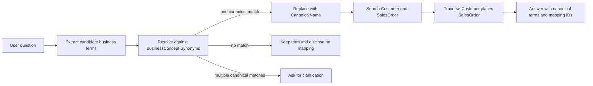
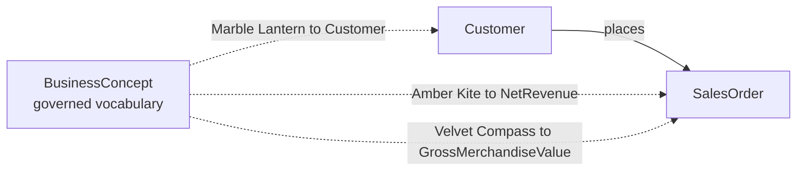
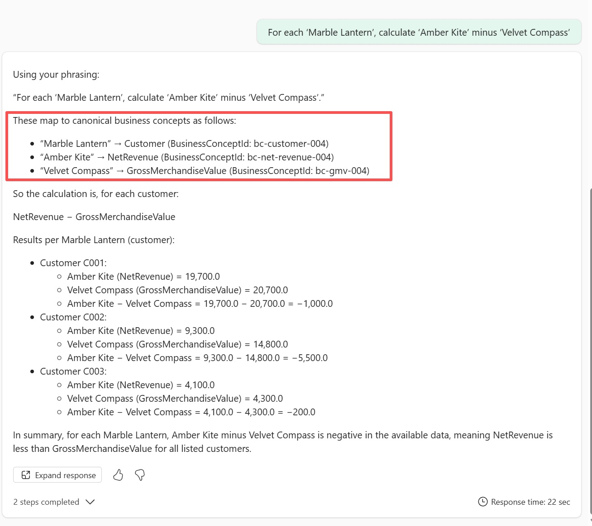
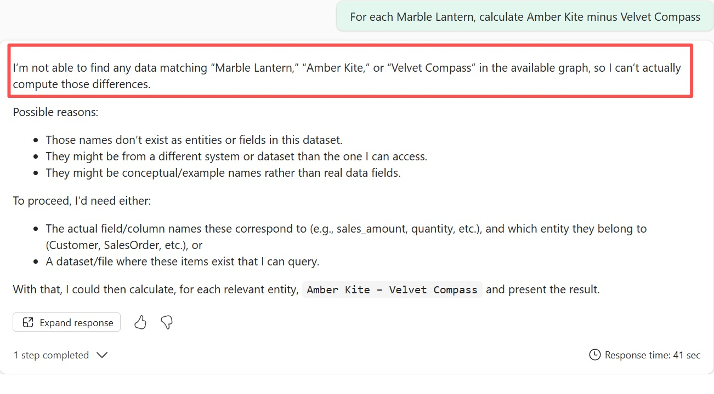

# Fabric Ontology Value Synonym Sample

This sample uses the `BusinessConcept` entity as a governed vocabulary for Microsoft Fabric Ontology. A Data Agent resolves business-specific terms to canonical ontology names before searching business entities and relationships.

## 1. User pain

Business users often use internal abbreviations, historical names, or regional terms. Familiar terms can be inferred by a language model, but inference is not deterministic or auditable. This sample therefore proves governed resolution with private terms:

| User term | Canonical name | Mapping ID |
| --- | --- | --- |
| `Amber Kite` | `NetRevenue` | `bc-net-revenue-004` |
| `Marble Lantern` | `Customer` | `bc-customer-004` |
| `Velvet Compass` | `GrossMerchandiseValue` | `bc-gmv-004` |

These phrases are intentionally unrelated to finance or customer terminology. The acceptance test uses subtraction in both directions, so choosing the right available fields but swapping the two private measure meanings produces the wrong sign.

## 2. Resolution contract

Fabric Ontology does not automatically treat an arbitrary property as a deterministic synonym index. The Data Agent explicitly queries active `BusinessConcept.Synonyms` values and retains the matching `BusinessConceptId` as evidence of resolution.

## 3. Solution summary



Core design decisions:

- The Lakehouse table stores one synonym mapping per row.
- `BusinessConceptId` uniquely identifies each mapping instead of repeating the canonical concept key.
- `ConceptGroupId` groups mappings that belong to the same canonical concept.
- `Synonyms` contains one exactly matchable value per row rather than a comma-separated string or JSON array.
- The AI performs deterministic lookup before searching the target ontology.
- Unmatched and ambiguous values are handled explicitly; silent guessing is prohibited.

## 4. Demo data model

The demo stays intentionally small while providing a real ontology search target:



`Customer` is bound to `customers`. `SalesOrder` is bound to `sales_orders`, which also contextualizes the `places` relationship through its `CustomerId` and `SalesOrderId` columns. Because this demo targets a non-schema Lakehouse, the ontology bindings omit `sourceSchema`. This lets the demo answer a useful question after canonicalization rather than merely displaying synonym records.

Lakehouse managed Delta table `business_concept_synonyms`：

| Column | Type | Purpose |
| --- | --- | --- |
| `BusinessConceptId` | string | Ontology entity key; unique for each synonym mapping |
| `ConceptGroupId` | string | Stable group ID for mappings of the same canonical concept |
| `CanonicalName` | string | Governed name and ontology display name |
| `Synonyms` | string | One synonym or canonical name |
| `Description` | string | Business definition |
| `IsActive` | boolean | Whether the mapping is eligible for resolution |

Each row is independently addressable and auditable through `BusinessConceptId`.

## 5. Step-by-step guide

### Step 0: Prerequisites

1. Confirm that Fabric IQ Ontology preview is enabled for the tenant and workspace.
2. Prepare a Fabric workspace and ensure the operator has at least the `Contributor` role.
3. Create or select the target **non-schema Lakehouse** and ensure OneLake security is not enabled.
4. Confirm that the source is a managed Delta table without Delta column mapping enabled.

### Step 1: Create the demo tables

Open [demo/setup-business-concepts.ipynb](demo/setup-business-concepts.ipynb) in Fabric, attach it to the target Lakehouse, and run the cells from top to bottom. The notebook creates and seeds `business_concept_synonyms`, enforces the ambiguity quality gate, and creates the sample-owned `customers` and `sales_orders` managed Delta tables.

Each active synonym must map to exactly one canonical name. The setup notebook enforces this rule with the following quality check:

```sql
SELECT lower(trim(Synonyms)) AS NormalizedSynonym,
       count(DISTINCT CanonicalName) AS CanonicalCount
FROM business_concept_synonyms
WHERE IsActive = true
GROUP BY lower(trim(Synonyms))
HAVING count(DISTINCT CanonicalName) > 1;
```

Any returned row represents an ambiguity that must be governed. The notebook fails when conflicts exist.

### Step 2: Verify the source schema

Confirm that the synonym table's six columns match the table above. Also verify `customers(CustomerId, CustomerName, Region)` and `sales_orders(SalesOrderId, CustomerId, OrderDate, OrderStatus, GrossMerchandiseValue, NetRevenue)`. All entity keys use `String`; monetary values use `Double`; `OrderDate` uses `DateTime`.

### Step 3: Plan the ontology pair

The importer creates two ontologies over the same business tables:

| Ontology | Entity types | Purpose |
| --- | --- | --- |
| `BusinessConceptDemoNoSchema` | `BusinessConcept`, `Customer`, `SalesOrder` | Resolves governed synonyms before business search |
| `BusinessDemoWithoutSynonyms` | `Customer`, `SalesOrder` | Baseline without the governed vocabulary |

Both contain the `Customer places SalesOrder` relationship.

```text
BusinessConcept
  key: BusinessConceptId (String)
  display: CanonicalName (String)
  properties:
    BusinessConceptId, ConceptGroupId, CanonicalName,
    Synonyms, Description, IsActive
  static binding:
    business_concept_synonyms in the Lakehouse

Customer
  key: CustomerId (String)
  display: CustomerName (String)
  properties: CustomerId, CustomerName, Region
  static binding: customers

SalesOrder
  key and display: SalesOrderId (String)
  properties: SalesOrderId, OrderDate, OrderStatus,
              GrossMerchandiseValue, NetRevenue
  static binding: sales_orders

Customer places SalesOrder
  contextualization: sales_orders
  source key: CustomerId
  target key: SalesOrderId
```

Use the stable entity and property IDs in [demo/ontology/id-map.json](demo/ontology/id-map.json). These ontology-local IDs may be reused across environments, but the binding GUID, workspace ID, and Lakehouse item ID must match the deployment target.

### Step 4: Identify Fabric names

Record the exact display names of the target workspace, Lakehouse, and optional target folder. The import notebook resolves them to the GUIDs required internally by the Fabric REST API. Folder matching is recursive and requires a unique exact display name; leave `folder_name` empty to create items in the workspace root.

If the notebook runs in the target workspace with the target Lakehouse attached, both parameters may remain empty. The notebook then reads `currentWorkspaceName` and `defaultLakehouseName` from `notebookutils.runtime.context` before resolving them through the Fabric API.

### Step 5: Import both ontology definitions

Use [demo/import-ontology.ipynb](demo/import-ontology.ipynb) to validate and import both ontologies. The notebook embeds the entity and binding definitions, so it remains self-contained after upload to Fabric.

1. Upload or open the notebook in the target Fabric workspace.
2. Attach the Lakehouse containing `business_concept_synonyms`.
3. Set `workspace_name` and `lakehouse_name` to exact Fabric display names, or leave them empty to use the current workspace and attached Lakehouse names. Optionally set `folder_name`; customize the two ontology and two Data Agent names as needed.
4. Keep `confirm_import = False` and run all cells to resolve the names and review the import preview. Preview mode performs read-only discovery requests but does not create or update Fabric items.
5. Set `confirm_import = True` and rerun all cells to create both ontologies and their Data Agents.

The notebook imports each ontology, refreshes and validates its managed `GraphModel`, and then creates the associated Data Agent. The enabled Data Agent receives the synonym-resolution policy; the baseline Data Agent receives no custom instructions.

### Step 6: Validate and inspect

1. Open both ontologies in the Fabric portal.
2. In `BusinessConceptDemoNoSchema`, confirm that `BusinessConcept`, `Customer`, and `SalesOrder` contain instances.
3. In `BusinessDemoWithoutSynonyms`, confirm that only `Customer` and `SalesOrder` are available.
4. Confirm that both ontologies expose `Customer places SalesOrder`.
5. Confirm that each Data Agent lists its corresponding graph source.

### Step 7: Compare agent configurations

The importer embeds [demo/ai-instructions.md](demo/ai-instructions.md) in `BusinessConceptSynonymAgent`. `BusinessBaselineAgent` has no AI instructions and no `BusinessConcept` entity. This is a package-level A/B comparison of the complete synonym solution, not an experiment that isolates only the ontology entity or only the instruction text.

### Step 8: Validate end to end

Use [demo/test-cases.md](demo/test-cases.md) to run each private-term question against both Data Agents and compare the results.

### Step 9: Compare query results

Submit the private-term calculation to both Data Agents:

```text
For each 'Marble Lantern', calculate 'Amber Kite' minus 'Velvet Compass'.
```

#### Synonym-enabled agent

`BusinessConceptSynonymAgent` resolves the private terms through `BusinessConcept`, reports the governed mapping IDs, and calculates the result for each customer.



#### Baseline agent

`BusinessBaselineAgent` has neither the `BusinessConcept` vocabulary nor synonym instructions. It cannot associate the private terms with `Customer`, `NetRevenue`, and `GrossMerchandiseValue`, so it cannot execute the calculation.



The comparison demonstrates the value of governed synonym resolution: the enabled agent uses explicit, auditable mappings, while the baseline does not guess meanings for organization-specific terms.

## 6. Updating synonym data

For synonym-only changes, refreshing the existing ontology is the preferred and simplest approach:

1. Update `synonym_records` in [demo/setup-business-concepts.ipynb](demo/setup-business-concepts.ipynb).
2. Rerun the setup notebook against the same Lakehouse.
3. Open `BusinessConceptDemoNoSchema` in Fabric and select **Refresh**.

The baseline ontology does not use `business_concept_synonyms`, so it does not require a refresh for synonym-only changes. The existing Data Agent continues using the same managed GraphModel and does not need to be updated.

Rerun [demo/import-ontology.ipynb](demo/import-ontology.ipynb) only when changing ontology entities, properties, bindings, relationships, embedded Data Agent instructions, or when an automated refresh is required.

## 7. Repository contents

| Path | Purpose |
| --- | --- |
| [demo/setup-business-concepts.ipynb](demo/setup-business-concepts.ipynb) | Creates demo tables and validates source readiness |
| [demo/import-ontology.ipynb](demo/import-ontology.ipynb) | Imports both ontologies and creates their instructed and baseline Data Agents |
| [demo/ontology](demo/ontology) | Checked-in ontology definition and stable ID map |
| [demo/ai-instructions.md](demo/ai-instructions.md) | Concise Data Agent resolution policy |
| [demo/test-cases.md](demo/test-cases.md) | Proof and governance test cases |
